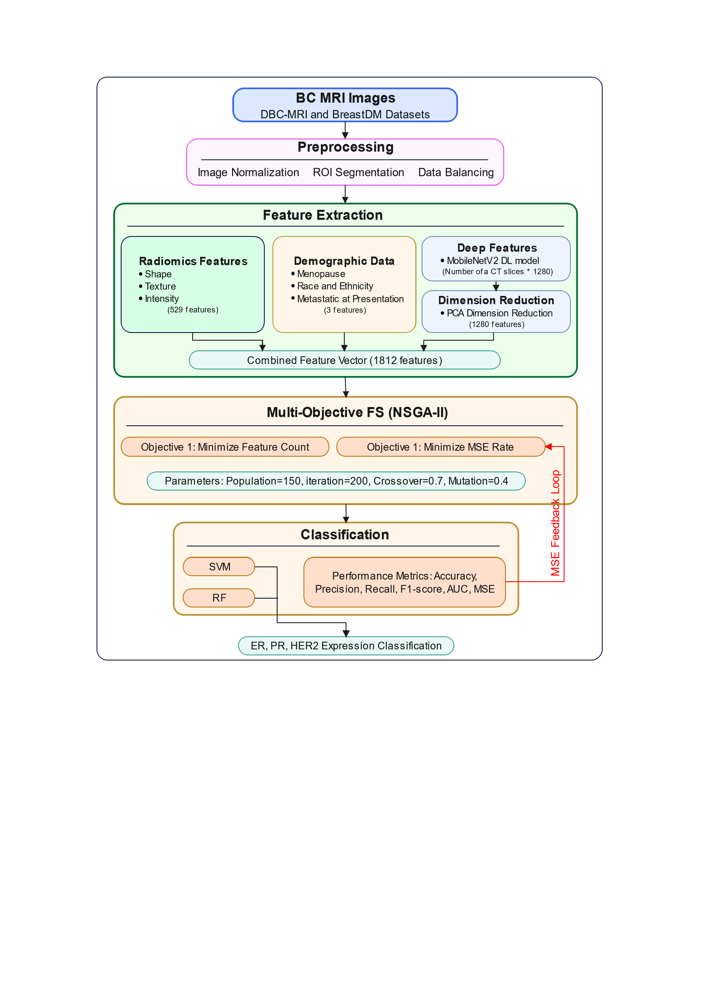

# Multi-Objective Feature Selection of Radiomics and Deep Learning Features for Breast Cancer Subtype Detection

Breast cancer (BC) is a heterogeneous disorder distinguished by many subtypes determined by the expression of estrogen receptor (ER), progesterone receptor (PR), and human epidermal growth factor receptor 2 (HER2). These indications are crucial for guiding treatment protocols and predicting patient outcomes. Identifying these biomarkers remains challenging for researchers. This study addresses this challenge by introducing an innovative approach that integrates radiomics features with deep features. We use a trainable multi-objective optimizer to identify the optimal minimal feature set, thereby improving the detection of ER, PR, and HER2 expression. Initially, radiomic and deep learning (DL) characteristics are retrieved from magnetic resonance imaging (MRI) patients, and the demographic data are integrated with the radiomic characteristics. On the other side, the MobileNetV2 DL pretrained model is used to extract features, and principal component analysis (PCA) is utilized for dimensionality reduction of the retrieved DL features. In the second stage, the trainable multi-objective metaheuristic optimizer non-dominated sorting genetic algorithm II (NSGA-II) was used to pick optimum minimum features from radiomic and DL features. Ultimately, the ER/PR and HER2 statuses are categorized using support vector machine (SVM) and random forest (RF) classifiers. Using the RF classifier with combined radiomics and DL features, we achieved HER2 prediction (AUC: 0.913, accuracy: 89.19%), ER prediction (AUC: 0.790, accuracy: 77.32%), and PR prediction (AUC: 0.770, accuracy: 76.49%) on the DBC-MRI dataset. External validation on the BreastDM dataset confirmed generalizability (accuracy: 86.16%, AUC: 0.877). NSGA-II reduced feature dimensionality by 65% while maintaining performance, with significant improvement over single-modality approaches (p<0.05). 

#

